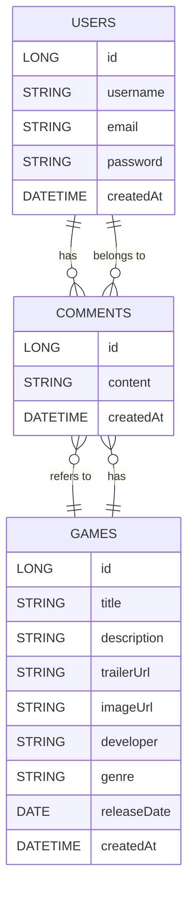

# NextIndie

Requiere Maven Docker npm Java
```diff
Set-ExecutionPolicy -ExecutionPolicy RemoteSigned -Scope CurrentUser
Invoke-RestMethod -Uri https://get.scoop.sh | Invoke-Expression
scoop bucket add java
scoop install java/openjdk
scoop install main/maven
mvn -v
-(reinicia)
```

Para probar el proyecto en local, ejecutamos el docker-compose.yml en backend e iniciamos SpringBoot
```diff
cd backend
-(tiene que estar up el docker)
docker compose up -d
-(esto crea las tablas automáticamente)
mvn spring-boot:run
-(Abre nuevocmd)
docker exec -it nextindie_db psql -U admin -d nextindie_db
```

# Comandos de REACT
```
# Opción A: Crear React con Vite (más rápido y ligero)
npm create vite@latest . -- --template react-ts

# Instalar dependencias
npm install

# En caso de proyecto clonado, proceder desde aquí
# Instalar dependencias adicionales necesarias
npm install react-router-dom axios

# Iniciar servidor de desarrollo
npm run dev
```
# Diagrama ER Base - NextIndie


