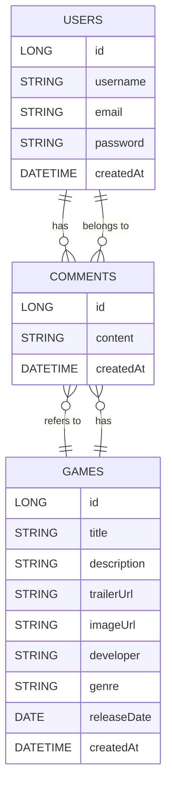

# NextIndie

Requiere Maven Docker npm Java
```diff
Set-ExecutionPolicy -ExecutionPolicy RemoteSigned -Scope CurrentUser
Invoke-RestMethod -Uri https://get.scoop.sh | Invoke-Expression
scoop bucket add java
scoop install java/openjdk
scoop install main/maven
mvn -v
-(reinicia)
```

Para probar el proyecto en local, ejecutamos el docker-compose.yml en backend e iniciamos SpringBoot
```diff
cd backend
-(tiene que estar up el docker)
docker compose up -d
-(esto crea las tablas automáticamente)
mvn spring-boot:run
-(Abre nuevocmd)
docker exec -it nextindie_db psql -U admin -d nextindie_db
```

# Comandos de REACT
```
# Opción A: Crear React con Vite (más rápido y ligero)
npm create vite@latest . -- --template react-ts

# Instalar dependencias
npm install

# En caso de proyecto clonado, proceder desde aquí
# Instalar dependencias adicionales necesarias
npm install react-router-dom axios

# Iniciar servidor de desarrollo
npm run dev
```
## 🧠 Descripción General

Este proyecto consiste en una plataforma centrada en videojuegos donde los usuarios podrán interactuar con contenido de forma dinámica. La idea principal es permitir que los usuarios registrados puedan **comentar, guardar y descubrir juegos**, priorizando aquellos que resulten más relevantes para ellos.

Uno de los enfoques clave del sistema es la organización del contenido en torno a dos vistas principales:

- **VideoFeed (vista principal)** → centrada en contenido visual (trailers).
- **Vista calendario (pendiente de implementación)** → organizada por fechas de lanzamiento.
- **Vista ranking(monetizable)(pendiente de implementación)** → juegos mejor votados o pagados

---

## 👤 Sistema de Usuarios

Los usuarios registrados podrán:

- Iniciar sesión en la plataforma.
- Comentar juegos de forma ilimitada.
- Guardar juegos en una lista personal.
- Consultar información de juegos.
- Personalizar su perfil (visible al comentar).
- Acceder a su colección de juegos guardados.

> ⚠️ Nota: Los usuarios no podrán modificar juegos, solo interactuar con ellos.

---

## 🎮 Gestión de Juegos

Cada juego en la plataforma contará con:

- 🎥 **Trailer obligatorio** (elemento clave para la vista principal).
- 📅 **Fecha de lanzamiento (release date)** — fundamental para la futura vista calendario.
- 📝 **Sistema de comentarios** abierto a todos los usuarios registrados.
- ❤️ **Interacciones sociales**:
  - Likes (pendiente de implementación).
  - Guardados (ya contemplado).
  - Compartir.

---

## 🧾 Vistas del Sistema

### 📺 VideoFeed (Vista Principal)

- Muestra juegos a través de trailers de manera aleatoria.
- Permite interacción rápida:
  - Dar like (futuro).
  - Comentar.
  - Guardar.
  - Compartir.

---

### 📅 Vista Calendario (Pendiente)

- Organizará los juegos según su **fecha de lanzamiento**.
- Mostrará con prioridad:
  - Juegos guardados por el usuario.
- Sistema de calendario aún por definir.

---

### 🔍 Vista de Detalles del Juego

Cada juego tendrá una página dedicada accesible mediante:

- Click directo desde el feed.
- Búsqueda en la base de datos (pendiente de implementación).

Incluye:

- Información completa del juego.
- Trailer.
- Comentarios.
- Interacciones del usuario.

---

### 👤 Perfil de Usuario

Cada usuario contará con un perfil donde podrá:

- Personalizar su identidad visual.
- Ver sus comentarios.
- Consultar su lista de juegos guardados.

---

## 🗃️ Modelo de Datos (Conceptual)

Entidades principales:

- **User**
- **Game**
- **Comment**
- **SavedGames**

Relaciones clave:

- Un usuario puede:
  - Comentar múltiples juegos.
  - Guardar múltiples juegos.
- Un juego puede:
  - Tener múltiples comentarios.
  - Ser guardado por múltiples usuarios.

---

## 🚀 Futuras Mejoras

Se prevé la incorporación de nuevas funcionalidades:

- 👍 Tabla `gameLike` → para gestionar likes en juegos.
- ❤️ Tabla `commentLike` → para likes en comentarios.
- 🔎 Sistema de búsqueda avanzada de juegos.
- 📅 Implementación completa del sistema de calendario.

# Diagrama ER Base - NextIndie


